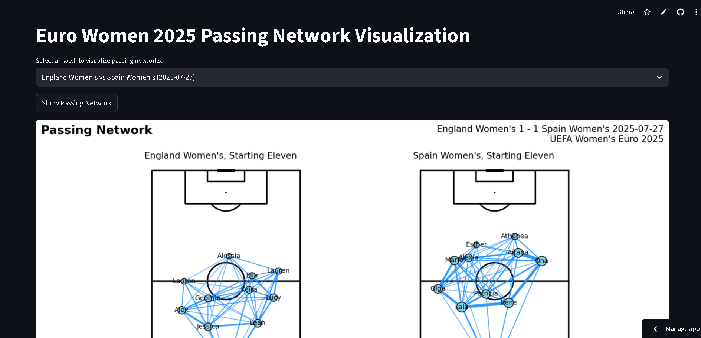

<p align="center">
  
</p>

# UEFA Women's Euro 2025 Passing Network – Streamlit App

This project provides an interactive, reproducible workflow for visualizing football passing networks using open StatsBomb data, with a focus on the UEFA Women's Euro 2025. The Streamlit app allows you to explore passing networks for any match in the dataset, with a clean, presentation-ready design.

## 🚀 Try the App

You can interact with the passing network visualizer here:

👉 [Streamlit App Live Demo](https://women-euro-2025-passing-network-app.streamlit.app/)

---

## Features

- **Interactive Match Selection:** Choose any match from the UEFA Women's Euro 2025 dataset and instantly view passing networks for both teams.
- **Data Access:** Uses the `statsbombpy` library to access open StatsBomb event data.
- **Passing Network Calculation:** Extracts starting XIs, computes average player positions, and builds passing matrices for each team, focusing on completed passes between starting players.
- **Visualization:** Plots side-by-side passing networks for both teams using `mplsoccer` and `matplotlib`, with node sizes and edge widths scaled to reflect pass volume.


## How to Use Locally

1. **Clone the Repository:**
   ```bash
   git clone https://github.com/<your-username>/Women_Euro_2025_Passing_Network.git
   cd Women_Euro_2025_Passing_Network/Euro_Women_Passing_Streamlit
   ```
2. **Install Requirements:**
   ```bash
   pip install -r requirements.txt
   ```
3. **Run the Streamlit App:**
   ```bash
   streamlit run streamlit_app.py
   ```
4. **Explore:**
   - Use the dropdown to select a match and view the passing networks for both teams.

## Project Structure

- `streamlit_app.py` – Main Streamlit app for interactive visualization
- `Euro_Women_2025_passing_network.py` – Core logic for data processing and plotting
- `requirements.txt` – List of required Python packages
- `logo.png` – Branding image for the plots

## Credits

- Built with [StatsBomb Open Data](https://github.com/statsbomb/open-data) and [statsbombpy](https://github.com/statsbomb/statsbombpy)
- Visualization powered by [mplsoccer](https://mplsoccer.readthedocs.io/)

## License

See `LICENSE` for details.

---

<p align="center">
  <em>UEFA Women's Euro 2025 Passing Network &mdash; Interactive Football Analytics</em>
</p>
